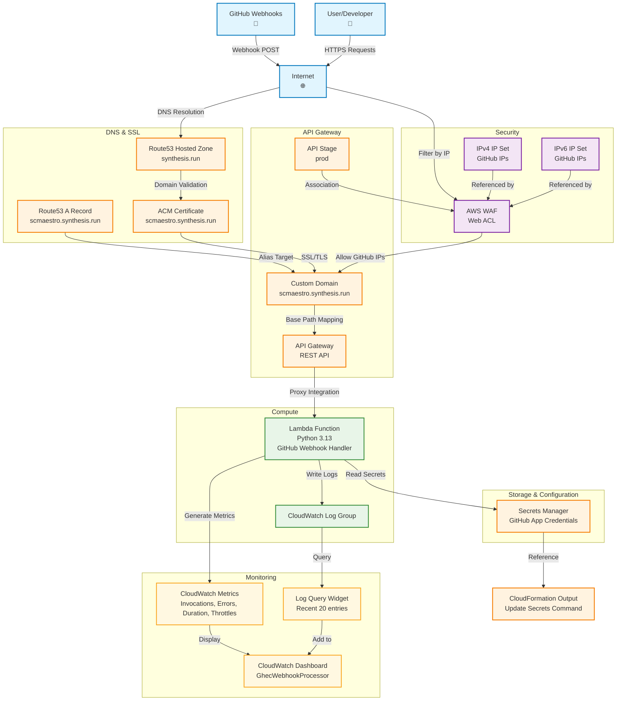

# GitHub App AWS Architecture Diagram

## Resource Relationships Summary

### Security Flow
1. **WAF Protection**: GitHub webhooks must come from approved IP ranges (IPv4/IPv6 sets)
2. **SSL Termination**: ACM certificate provides HTTPS encryption
3. **Domain Validation**: Route53 validates certificate ownership

### Request Flow
1. **GitHub** sends webhook → **Internet**
2. **DNS Resolution** via **Route53 Hosted Zone**
3. **WAF Filtering** checks source IP against GitHub IP sets
4. **Custom Domain** routes to **API Gateway**
5. **API Gateway** proxies request to **Lambda Function**
6. **Lambda** processes webhook and reads **Secrets Manager**

### Monitoring Flow
1. **Lambda** generates metrics and logs
2. **CloudWatch Dashboard** displays:
   - Function invocations, errors, duration, throttles
   - Recent log entries (last 20)
3. **Operational Output** provides command to update secrets

### Key Security Features
- **IP Whitelisting**: Only GitHub webhook IPs allowed
- **HTTPS Only**: Custom domain with ACM certificate
- **Secrets Management**: GitHub credentials stored securely
- **Monitoring**: Comprehensive dashboard for operational visibility
